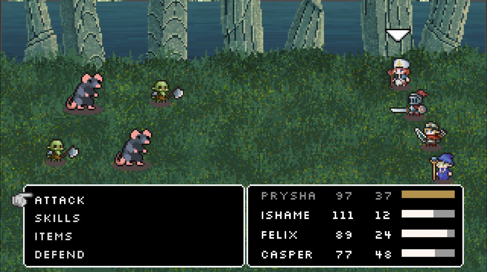
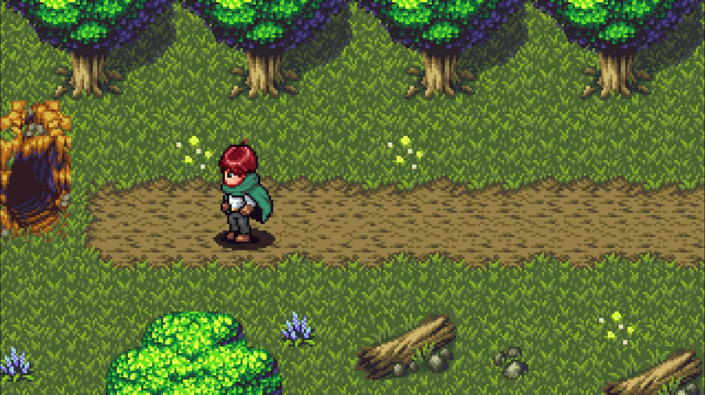

# Innominatam

A turn-based RPG built with Godot 4, inspired by pre-pixel-art era JRPGs — the NES and early SNES classics before the pixel-art aesthetic became standard. Think Final Fantasy I–IV, Dragon Quest, and the dawn of console role-playing.

> **Innominatam** is Latin for "unnamed" — a deliberate blank slate fitting a story yet unwritten.

---

## Status

Early development. Core battle system, overworld exploration, inventory/equipment, dialog, and quest frameworks are in place. Content is sparse — the skeleton is assembled, the meat is next.

---

## Features

### Combat — ATB (Active Time Battle)



Menu-driven turn system inspired by Final Fantasy IV–IX. Each combatant charges an ATB bar at a rate determined by their **Speed** stat. When a bar fills, that character acts.

- **Attack** — standard physical damage vs. defense formula
- **Skill** — special abilities (Heal, Fireball, Mass Restoration) with MP cost, scaling off Faith or Intelligence
- **Item** — use consumables mid-battle (Health Potion)
- **Defend** — halves incoming damage for one turn

Damage and healing appear as **Floating Combat Text** (FCT) with tweened pop-up animations. Critical hits render in crimson.

Battle transitions use a shader-based wipe effect.

### Party

Four characters, each with a distinct stat profile and class identity:

| Name | Role | Primary Stat | Special |
|------|------|-------------|---------|
| **Prysha** | Healer | Faith | Heal, Mass Restoration |
| **Ishamel** | Knight | Strength, Defense | Tank, highest HP |
| **Felix** | Archer | Dexterity, Speed | Fast, physical damage |
| **Casper** | Mage | Intelligence | Fireball (AoE) |

Characters gain XP and level up with per-class stat scaling.

### Overworld Exploration



Top-down tile-based overworld with 4-direction movement, grid-snapped to a pixel-art aesthetic. The player sprite animates per-direction (idle/walk states via state machine).

**Maps:**
- Overworld (playground hub)
- Gentle Forest
- Cave
- Houses / interiors

Collision layers: Player vs. Walls. Camera follows the player.

### Inventory & Equipment

Press **I** to open inventory, **C** for equipment menu.

Three equipment slots per character:
- **Weapon** (boosts Strength)
- **Armor** (boosts Defense)
- **Amulet** (stat bonuses)

Equipment equips/unequips from the equipment screen. Consumable items (Health Potion) usable from battle or inventory.

### Dialog System

Typewriter-effect text with speaker name, optional portrait, and branching dialog options. NPCs use talk-bubble indicators and trigger dialog on interaction.

### Quest System

Two quests pre-defined:

- **The Missing Sword** — find and return the Diamond Sword
- **Orc Extermination** — defeat 5 orc encounters

Quests track objectives (kill-count, item-find) and emit signals on start/update/complete. Quest log viewable with **J**.

### Save & Load

JSON-based save system (F5 save, F9 load). Preserves:
- Party state (HP, MP, stats, equipment, level)
- Inventory contents
- Quest progress
- Dialog states (already-seen flags)
- World state (picked-up items, defeated encounters, player position)

---

## Controls

| Key | Action |
|-----|--------|
| Arrow / WASD | Move (overworld) |
| Enter / Space | Interact / Confirm |
| I | Toggle inventory |
| C | Toggle equipment |
| J | Toggle quest log |
| F5 | Save game |
| F9 | Load game |

---

## Tech Stack

- **Engine:** Godot 4.6 (Forward Plus / gl_compatibility renderer)
- **Resolution:** 320×180 (viewport stretched to window)
- **Fonts:** BoldPixels, PixelSerif, Silkscreen
- **Assets:** UI elements are original; sprites and backgrounds sourced from free-to-use online repositories
- **Language:** GDScript

### Turnity Addon

Includes a custom Godot plugin **Turnity** (v1.0.0) for turn management. Socket-based architecture supporting serial and dynamic-queue turn modes. Developed by BananaHolograma.

---

## Project Structure

```
Innominatam/
├── project.godot              # Godot project file
├── Assets/                    # Sprites, textures, UI elements
│   ├── MainMenu.jpg           # Menu background
│   ├── PlayerSprite.png       # Overworld player spritesheet
│   ├── PlayerSpriteBattle.png # Battle sprite
│   ├── SoldierIdle.png        # NPC sprite
│   ├── Knight.png / Mage.png / Healer.png / Archer.png
│   ├── Orc1.png / rat.png     # Enemy sprites
│   └── Rock-Buttons-*.png     # UI button assets
├── Scenes/
│   ├── main_menu.tscn/.gd     # Title screen (Play / Load / Settings / Quit)
│   ├── playground.tscn/.gd    # Overworld hub
│   ├── battle.tscn/.gd        # Battle scene (~1300 lines)
│   ├── battle_actor.gd        # BattleActor resource class
│   ├── atb.gd                 # ATB bar (extends ProgressBar)
│   ├── PartyManager.gd        # Party creation, leveling, stat scaling
│   ├── InventoryManager.gd    # Item inventory CRUD
│   ├── EquipmentMenu.gd       # Equipment screen logic (~400 lines)
│   ├── SaveManager.gd         # JSON serialization/deserialization
│   ├── QuestManager.gd        # Quest lifecycle
│   ├── Quest.gd / QuestObjective.gd
│   ├── dialog_manager.gd      # Typewriter dialog with branching
│   ├── dialog_box.tscn/.gd    # Dialog box UI
│   ├── fct.gd                 # Floating combat text (tweened popups)
│   ├── battle_transition.gd   # Shader-based scene transitions
│   ├── SoundManager.gd        # SFX pool manager
│   ├── SoundManager.gd        # SFX + BGM player
│   ├── player.gd              # Player character (CharacterBody2D)
│   ├── player_state_machine.gd
│   ├── state.gd / state_idle.gd / state_walk.gd
│   ├── enemies.gd             # Enemy templates (Knight, Orc, Rat)
│   ├── Skills.gd              # Skill definitions
│   ├── Items.gd               # Item definitions
│   ├── Stats.gd               # Stats resource (extends Resource)
│   └── WorldState.gd          # Persistent world tracking
├── Tile Maps/
│   ├── overworld.tscn         # Overworld tilemap
│   ├── gentle_forest.tscn     # Forest area
│   ├── cave.tscn              # Cave area
│   ├── houses.tscn            # Interior maps
│   └── Sprites/               # Tile spritesheets
├── sounds/
│   ├── BGM/                   # Title Theme, Battle 1
│   └── SFX/                   # Heal, pickup, melee hit
├── fonts/                     # BoldPixels, PixelSerif, Silkscreen
├── Theme/                     # UI theme files
├── addons/turnity/            # Turnity plugin: turn_manager.gd, turn_socket.gd
└── debug.gd                   # Debug autoload
```

---

## Getting Started

1. Download and install [Godot 4.6](https://godotengine.org/download/)
2. Clone this repository
3. Open `project.godot` in the Godot editor
4. Run the main scene (`Scenes/main_menu.tscn`)
5. Play!

The main menu offers **Play** (start new game), **Load** (continue from save), and **Quit**.

---

## Roadmap

Near-term priorities:

- [ ] Enemy AI beyond basic attack
- [ ] More skills, items, and equipment
- [ ] Proper story content, NPCs, and quest writing
- [ ] More map areas and dungeon design
- [ ] Polish battle animations and feedback
- [ ] Settings menu (audio controls, key rebinding)
- [ ] Game-over handling with continue/retry

---

## License

MIT
